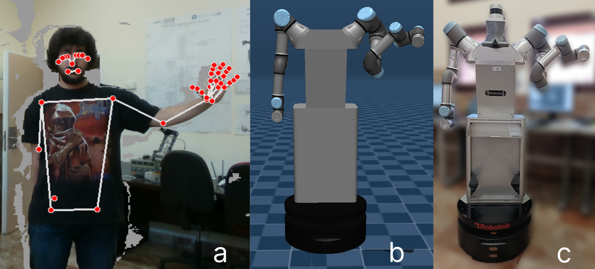
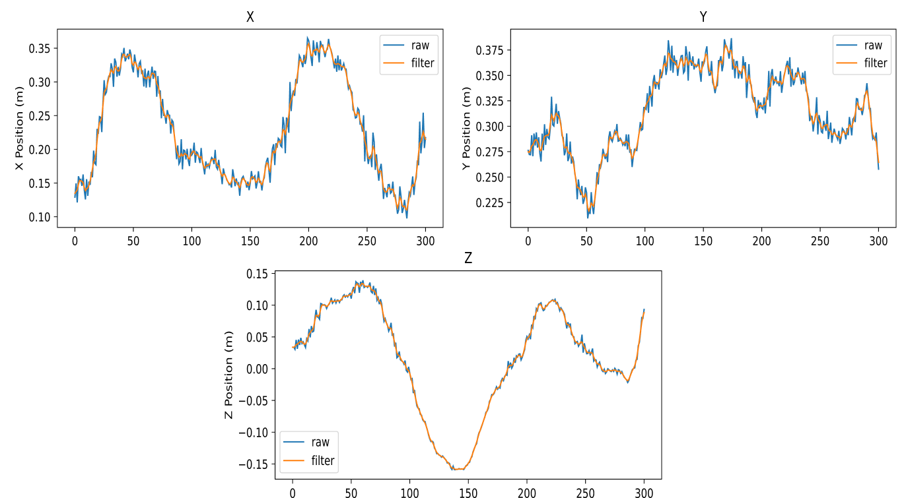

# **Human-Like Trajectory Planning for Robotic Manipulators**
<p align="center">
  
</p>

This project focuses on the tracking of people to collect data for Imitation Learning purposes. It is composed of a detection of the significant points of the human arm using Mediapipe, a Gaussian filtering process to smooth the movements and filter the sensor noise, a methodology based on UR3 analytical inverse kinematics to obtain the most human-like configuration of the robot for each human pose recorded and, lastly, a trajectory generation process that builds a smooth and feasible trajectory for the robot based on these human-like joint position waypoints.

# Usage
To use the proposed algorithm directly on the model of the robot and robotic arm presented in the paper, it is necessary to have both [MATLAB (R2022a)](https://es.mathworks.com/products/new_products/release2022a.html) and the [MujoCo](https://github.com/openai/mujoco-py) simulator installed. The simulator used in this work has been developed by our laboratory and all the information can be found in [ADAM Simulator](https://github.com/vistormu/adam_simulator). The algorithm has been tested and uses the specific packages for the [RealSense D435i](https://www.intelrealsense.com/depth-camera-d435i/) camera. Feel free to use and apply the algorithm in other models and robotic arms.

The code is divided in two main folders:

`MatlabCode` stores all the files to apply the algorithm directly in Matlab.

`PythonCode` stores all the files to apply the algorithm directly in Python.

### **MatlabCode**
*Matlab Requierements:*
- Robotics System Toolbox
- Phased Array System Toolbox

The code available in **MatlabCode** contains:

`bodyx.stl` allows to load the full model of the ADAM robot in different body parts.

`HumanLikeArm.m` allows to run the full process once the data has been acquired.

`IK_UR.m` allows calculate the Analytical Inverse Kinematics (AIK) for different UR models such as UR3, UR5 and UR10.

If you want to use different UR model, in `IK_UR.m` modify the variables for the line:

```matlab
res = double(pyrunfile("UR3_Inverse_Kinematics.py","Sol",M = npM,name = name,launcher = launcher));
```
where `name` can be `ur3`, `ur5` or `ur10` and `launcher` can be `matlab` or `python`. The previous line calls `UR3_Inverse_Kinematics.py` that obtain the AIK values.

`distanceMetric.m` function to evaluate the distance between the human elbow and the rest of the robotic joints.

`distOrientation` function to evaluate the orientation of the end effector.

`distPosition` function to evaluate the position of the end effector.

`variationWrist` function to evaluate the wrist variation between the previous state and the actual state.

`PlotError.m` function to plot the error for the end-effector respect the human wrist.

To use the **MatlabCode** just run the `main_HumanLikeArm.m` script.

The **MatlabCode** also includes the trajectory generation based on the joint position waypoints obtained from human data and AIK. This is not available for now in the **PythonCode**.

### **PythonCode**
The code available in **PythonCode** contains:

`HumanLikeArm.py` works exactly the same as the MatlabCode one but all in Python.

`UR3_Inverse_Kinematics.py` allows to obtains the AIK solutions. The script return 8 solution for each point taking into account the limits for each arm.

`brazoProf.py` acquired the data from the camera an save it in the path specified. Must be the same that you use in `HumanLikeArm.py` and 
`HumanLikeArm.m`.

To use the **PythonCode** just run the `HumanLikeArm.py` script modifying the values of the path were the data is stored.

### **Data Acquisition**
The acquisition of the data can be only done using Python. For that purpose, you have to run the `brazoProf.py` file.

This will open a window that show the user moving with the MediaPipe lines for the Pose estimation and Hand Tracking.

Once the data as been acquired, pushing `q` or `esc` allows to stop the data acquisition. After that and previously to the storage of the data, a Gaussian Filter is applied. The filtered can be seen for wrist and elbow position and wrist orientation using:

``` python
plot_smoothed_EndEfector(DATOSPRE,XEnd,YEnd,ZEnd)
plot_smoothed_Elbow(CORCODOPRE,XElbow,YElbow,ZElbow)
plot_smoothed_rotations(DATOSPRE,R1,R2,R3,R4,R5,R6,R7,R8,R9)
```

<p align="center">
  
</p>

> **Note**: At the moment, the algorithm only works for the left arm. To obtain correct data, the right arm must be hidden behind the back.

# Citation
If you use this code, please quote our related works :blush:

```
@inproceedings{lopez2023taichi,
  title={TAICHI algorithm: Human-Like Arm Data Generation applied on Non-Anthropomorphic Robotic Manipulators for Demonstration},
  author={Lopez, Blanca and Prados, Adrian and Moreno, Luis and Barber, Ramon},
  booktitle={2023 European Conference on Mobile Robots (ECMR)},
  pages={1--7},
  year={2023},
  organization={IEEE}
}

```

```
@inproceedings{prados2023tracking,
  title={Tracking humano visual aplicado a manipuladores no antropom{\'o}rficos para imitaci{\'o}n},
  author={Prados, Adri{\'a}n and L{\'o}pez, Blanca and Barber, Ramon and Moreno, Luis},
  booktitle={XLIV Jornadas de Autom{\'a}tica},
  pages={714--719},
  year={2023},
  organization={Universidade da Coru{\~n}a. Servizo de Publicaci{\'o}ns}
}

```
